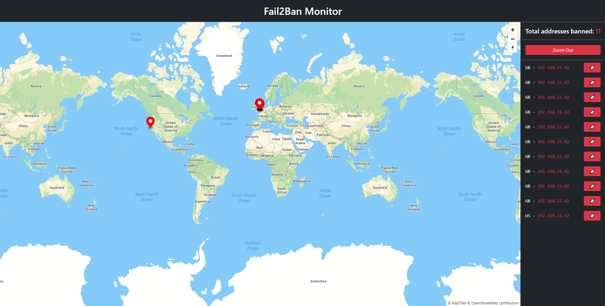

# Fail2Ban Monitor.
Simple svelteKit app to monitor fail2ban logs and banned addresses.

## Dependencies
- MapTileer API key (free tier is fine). You can get yours [here](https://www.maptiler.com/).

- Docker or Node Installed.
## Installation
- Via Docker (recommended)
Run the following command to start the app:

  `docker run --name F2BMONITOR_SERVER -p 3000:3000 -e MAPTILER_APIKEY=yourmaptilerapikey -v /path/to/fail2ban/logs:/app/logs frenzoid/fail2ban-monitor:latest`

- Via Node
  - Clone the repo
  - Install dependencies with `npm install`
  - Create a `.env` file in the root directory and add the following:
    - `MAPTILER_APIKEY=yourmaptilerapikey`
  - Run the app with `npm run build && npm run start`
  - Open [localhost:3000](http://localhost:3000) to view it in the browser.

